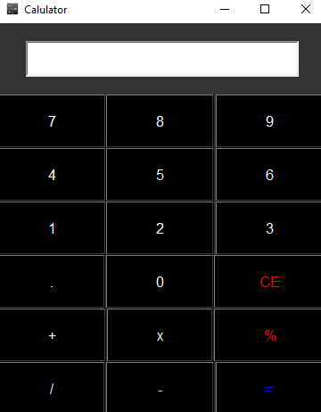

# Simple Calculator using Python tkinter
Python calculator using tkinter

This is my first Git project.     
This Simple calculator developed in Python using the standard Tkinter library.  
This project focused on creating an interactive GUI, in order to achieve an interface that is user-friendly.      
The `calc.exe` file, with that user can easily use with one click. 

## Preview

## Functionality

This calculator can support parentheses use and decimal numbers. It can support basic operations such as:

* Addition
* Subtraction
* Multiplication
* Division
* Modulus

## 
